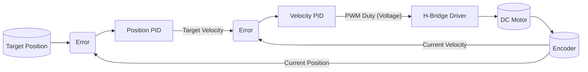
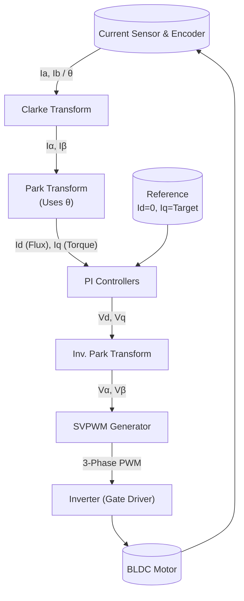

로봇 핸드와 같은 정밀 제어 시스템을 개발할 때 가장 고민되는 부분인 **DC 모터**와 **BLDC 모터**의 구동 방식 차이, 그리고 핵심 제어 알고리즘인 **FOC(Field Oriented Control)**에 대해 엔지니어링 관점에서 정리한 문서입니다.

---

## 1. DC 모터와 BLDC 모터: 아키텍처 비교

두 모터의 가장 큰 차이는 **전류의 흐름을 바꾸는(Commutation) 주체**가 기계적인가 전자적인가에 있습니다.

| 특징 | DC 모터 (Brushed DC) | BLDC 모터 (Brushless DC) |
| :--- | :--- | :--- |
| **구조** | 내부에 **브러시(Brush)**와 정류자 존재 | 브러시 없음, 영구자석 회전자 |
| **구동 회로** | **H-Bridge** (MOSFET 4개) | **3-Phase Inverter** (MOSFET 6개) |
| **제어 복잡도** | **하** (PWM 1~2핀으로 구동 가능) | **상** (위치 피드백에 따른 위상 제어 필수) |
| **토크 특성** | 전류에 비례 (선형적) | 위상 제어 방식에 따라 리플 발생 가능 |
| **주요 용도** | RC 서보, 완구, 비용 절감형 구동부 | 정밀 로봇 관절, 드론, 전기차 |

---

## 2. DC 모터 정밀 제어 (Position/Velocity Control)

DC 모터는 전압만 인가하면 회전하므로 구동 자체는 쉽지만, 로봇 관절로 쓰기 위해서는 **정밀한 위치 피드백**과 **PID 제어**가 필수입니다.

### 2.1 필수 센서 및 조합

로봇 핸드와 같이 '저속 고토크' 및 '부드러운 움직임'이 필요한 경우의 센서 조합입니다.

1.  **Motor-side Encoder (추천)**
    * **구성:** 모터 축 뒤에 엔코더 장착 $\rightarrow$ 감속기 $\rightarrow$ 출력축
    * **장점:** 감속기 기어비만큼 분해능이 증폭됨 (예: 100:1 기어비 사용 시 제어 정밀도 100배 향상). 속도 제어가 매우 부드러움.
    * **단점:** 기어의 백래시(Backlash)를 감지할 수 없음.
2.  **Joint-side Potentiometer**
    * **구성:** 감속기 출력축(관절)에 포텐셔미터 장착
    * **장점:** 절대 위치 파악 가능, 백래시 영향 없음.
    * **단점:** 분해능이 낮고 미분이 노이즈에 취약하여 저속 제어 시 떨림(Hunting) 발생 가능.

### 2.2 DC 모터 제어 알고리즘 (Cascade PID)

단순 위치 제어보다 **전류(토크) $\rightarrow$ 속도 $\rightarrow$ 위치** 순으로 제어 루프를 감싸는 **Cascade(다단) 제어**가 가장 안정적입니다.

**Flow Diagram (Mermaid):**

* **위치 제어기 (Outer Loop):** 목표 위치와 현재 위치의 차이를 계산해 **'목표 속도'**를 출력.
* **속도 제어기 (Inner Loop):** 목표 속도를 추종하도록 전압(PWM)을 조절. (Damping 효과로 부드러운 정지 가능)

---

## 3. BLDC 모터와 FOC (Field Oriented Control)

BLDC 모터를 DC 모터처럼 부드럽고 효율적으로 제어하기 위한 벡터 제어 기술입니다. 3상 교류를 수학적으로 변환하여 직류처럼 제어합니다.

### 3.1 FOC 제어 알고리즘 흐름 및 용어 설명

FOC는 **좌표 변환(Transform)**이 핵심입니다. 복잡한 AC 전류 파형을 수학적으로 정지시켜 DC 값으로 만든 뒤 제어합니다.

**FOC Block Diagram (Mermaid):**

#### 🛠️ 블록 상세 설명 및 핵심 용어

위 다이어그램의 각 단계별 의미는 다음과 같습니다.

1.  **Clarke Transform (클라크 변환)**
    * **역할:** $120^\circ$ 간격으로 배치된 3상 전류($I_a, I_b, I_c$)를 **직교하는 2상 정지 좌표계($\alpha, \beta$)**로 변환합니다.
    * **의미:** 3개의 축을 2개의 축(X, Y)으로 줄여 계산을 단순화하지만, 여전히 **교류(AC) 파형**입니다.

2.  **Park Transform (파크 변환) ★ 핵심**
    * **역할:** 정지 좌표계($\alpha, \beta$)를 회전하는 모터와 함께 도는 **회전 좌표계($d, q$)**로 변환합니다.
    * **입력:** 엔코더가 측정한 **전기각($\theta$, Electrical Angle)**이 반드시 필요합니다.
    * **결과:** 밖에서 볼 때는 교류였던 전류가, 회전하는 관점에서는 **일정한 직류(DC) 값**처럼 보입니다.

3.  **$I_d$ (Flux Current, 자속 전류)**
    * 자석의 힘을 만드는 성분입니다. 영구자석 모터(BLDC/PMSM)에서는 이미 자석이 있으므로, 이 전류는 불필요한 열만 발생시킵니다.
    * **제어 목표:** 보통 **0**으로 제어합니다. (단, 고속 회전 시 '약자속 제어'를 위해 음수로 제어하기도 함)

4.  **$I_q$ (Torque Current, 토크 전류)**
    * 회전력을 만드는 성분입니다. DC 모터의 전류와 똑같은 역할을 합니다.
    * **제어 목표:** 원하는 토크(힘)의 크기만큼 전류를 흘립니다.

5.  **PI Controllers (전류 제어기)**
    * $I_d$를 0으로, $I_q$를 목표값으로 맞추기 위해 **PID 제어**를 수행하여 전압 지령($V_d, V_q$)을 계산합니다.

6.  **SVPWM (Space Vector PWM)**
    * **역할:** 계산된 전압 벡터를 실제 인버터 스위치 3개(U, V, W)가 이해할 수 있는 PWM 신호로 변환합니다.
    * **장점:** 일반적인 사인파 PWM보다 전압 이용률을 약 **15%** 높여 모터 출력을 극대화합니다.

---

### 3.2 센서리스(Sensorless) FOC vs 센서 기반 FOC

| 구분 | 센서리스 FOC (Sensorless) | 센서 기반 FOC (Sensored) |
| :--- | :--- | :--- |
| **원리** | 역기전력(BEMF)을 관측(Observer)하여 위치 추정 | **엔코더**를 통해 물리적 위치 직접 측정 |
| **장점** | 센서 비용 절감, 배선 단순화 | **저속/정지 상태**에서도 완벽한 토크 제어 |
| **단점** | **초기 기동 시 위치 모름**, 저속 제어 불가능 | 센서 비용 및 배선 필요 |
| **적합 분야** | 드론 프로펠러, 팬, 펌프 | **로봇 팔, 로봇 핸드**, 짐벌 |

> **Note:** 로봇 핸드는 물체를 잡고 버티거나(Zero Speed High Torque), 아주 느리게 움직여야 하므로 **반드시 엔코더(예: AS5048 등)가 포함된 센서 기반 FOC**를 사용해야 합니다.

### 3.3 추천 영상 (YouTube)

**1. FOC 제어의 시각적 설명 (Great Scott!)**
FOC의 기본 원리와 파형을 아주 쉽게 설명해 주는 영상입니다.
<iframe width="560" height="315" src="https://www.youtube.com/embed/InzXA7mWBWE" title="YouTube video player" frameborder="0" allow="accelerometer; autoplay; clipboard-write; encrypted-media; gyroscope; picture-in-picture" allowfullscreen></iframe>

**2. 센서리스 vs 센서드 FOC 비교 (SimpleFOC)**
저속 제어에서 엔코더 유무가 어떤 차이를 만드는지 보여줍니다.
<iframe width="560" height="315" src="https://www.youtube.com/embed/D9sDRStP1xw" title="YouTube video player" frameborder="0" allow="accelerometer; autoplay; clipboard-write; encrypted-media; gyroscope; picture-in-picture" allowfullscreen></iframe>

---

## 4. 참고 자료 및 오픈소스 프로젝트

직접 바닥부터 코딩하기보다 검증된 라이브러리를 활용하는 것이 좋습니다.

* **[SimpleFOC (Arduino/STM32)](https://docs.simplefoc.com/)**
    * **특징:** Arduino 및 STM32를 지원하는 가장 직관적인 FOC 라이브러리. 로봇 연구용으로 최적.
    * **장점:** 복잡한 레지스터 설정 없이 FOC를 바로 테스트 가능.
* **[STM32 Motor Control SDK (MCSDK)](https://www.st.com/en/embedded-software/x-cube-mcsdk.html)**
    * **특징:** STMicroelectronics 공식 모터 제어 툴.
    * **장점:** 양산 레벨의 신뢰성, 고효율. (단, 초기 설정 난이도 높음)
* **[ODrive Project](https://odriverobotics.com/)**
    * **특징:** 고성능 로봇용 모터 드라이버 하드웨어 및 펌웨어.
    * **용도:** 강력한 토크 제어가 필요한 로봇 다리나 팔 개발 시 참고.
* **[VESC Project](https://vesc-project.com/)**
    * **특징:** 전동 보드용으로 시작했으나 현재 다목적 고출력 BLDC 제어기의 표준.

---

## 5. 요약: 로봇 핸드 개발자를 위한 제언

1.  **모터 선정:** 공간이 허락한다면 **BLDC + 마그네틱 엔코더** 조합이 베스트(소음 적고 토크 밀도 높음). 공간이 너무 협소하다면 고성능 DC 모터(Coreless) 사용.
2.  **센서 선정:** 부드러운 움직임을 위해 **모터 축(Motor-side) 엔코더**는 필수입니다. 포텐셔미터는 초기 위치 파악용 보조 센서로만 사용하세요.
3.  **제어 전략:** 위치 제어기 내부에 반드시 **속도 제어 루프**와 **전류 제어 루프**를 포함시켜야 고급스러운 동작(Compliance)을 구현할 수 있습니다.
