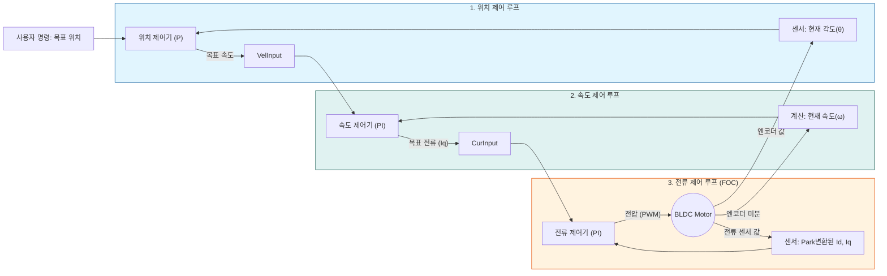

로봇 개발을 진행하며 모터 드라이버와 제어 알고리즘을 깊이 있게 공부하게 되었다. 단순한 회전이 아니라 정교한 힘 조절과 위치 제어를 위해 필수적인 **FOC(Field Oriented Control)**와 **캐스케이드 제어(Cascade Control)** 시스템에 대해 정리해 본다.

## 1. BLDC 제어를 위한 하드웨어 흐름

BLDC 모터를 제어하기 위해서는 MCU 혼자서는 불가능하며, 고전압/대전류를 다루기 위한 하드웨어 체인이 필요하다.

### 1.1 기본 연결 구조
제어 신호는 다음과 같은 순서로 흘러가며 증폭된다.

`MCU (Brain)` → `Gate Driver (Pre-Driver)` → `MOSFET (Switch)` → `BLDC Motor`

1.  **MCU:** 3.3V 수준의 약한 디지털 신호(PWM)로 명령을 내린다.
2.  **Gate Driver:** MCU의 신호를 받아 **부트스트랩(Bootstrap)** 회로 등을 이용해 전압을 승압(뻥튀기)하여 MOSFET의 게이트를 열어준다.
3.  **MOSFET:** 실제로 배터리의 큰 전력을 모터 코일에 공급하는 스위치 역할을 한다.

### 1.2 왜 전류 제어(Current Control)가 핵심인가?
우리의 목표는 모터의 **'토크(힘)'**를 제어하는 것이다. 물리적으로 **토크는 전류에 비례($\tau \propto I$)**한다.
하지만 우리는 전류를 직접 제어할 수 없고, **전압(PWM)**만 조절할 수 있다. 따라서 **"원하는 토크를 내기 위해, 실시간으로 전류를 측정하고, 그에 맞는 전압을 계산해서 쏴주는 과정"**이 모터 제어의 본질이다.

---

## 2. FOC(자계 지향 제어)의 역사와 원리

복잡한 3상 교류 모터를 마치 다루기 쉬운 DC 모터처럼 제어하기 위해 등장한 것이 FOC다.

### 2.1 거인들의 어깨 위에서 (History)
FOC는 어느 날 갑자기 뚝 떨어진 기술이 아니라, 수학적 발견들이 쌓여 완성되었다.

1.  **R.H. Park (1929):** 미국의 엔지니어. 3상 회로를 회전하는 2축 좌표계로 변환하는 **'파크 변환(Park Transformation)'** 수식을 발표했다. 당시에는 모터 해석을 위한 수학적 도구였다.
2.  **Edith Clarke (1930년대):** 최초의 여성 전기 공학자 중 한 명. 3상 좌표계를 정지된 2축 좌표계로 바꾸는 **'클라크 변환(Clarke Transformation)'**을 정리했다.
3.  **Felix Blaschke (1971):** 독일 지멘스(Siemens)의 엔지니어. 위의 수학적 변환들을 실제 모터 제어 알고리즘에 적용하여 **'자계 지향 제어(Field Oriented Control)'**를 창안했다.

### 2.2 이해를 돕는 비유: 회전문 (토크 vs 자속)
전류를 흘려도 다 같은 전류가 아니다. 모터를 **회전문**이라고 상상해 보자.

1.  **토크($I_q$):** 회전문의 손잡이를 잡고 결대로(수직으로) 미는 힘.
    * 문이 뱅글뱅글 잘 돌아간다. **(우리가 원하는 힘)**
2.  **자속($I_d$):** 회전문의 중심 기둥 쪽으로 꾹 누르는 힘.
    * 문은 꿈쩍도 안 하고 기둥만 찌그러진다. **(낭비되는 힘, 열 발생)**

FOC의 목표는 수학적 계산을 통해 **$I_d$(낭비)를 0으로 만들고, $I_q$(회전력)에만 전류를 몰아주는 것**이다.

---

## 3. 마법의 수학: 좌표 변환 (Coordinate Transformation)

어떻게 3개의 전선(3상 AC)을 2개의 직류 값($I_d, I_q$)으로 바꿀까? 여기서 **'회전목마'** 비유가 등장한다.

### 3.1 정지 좌표계 vs 회전 좌표계
* **3상 좌표계 (현실):** 밖에서 회전목마를 보면 말이 정신없이 지나간다. (전류값이 계속 변하는 AC 파형)
* **회전 좌표계 ($d-q$축):** 내가 **회전목마에 올라타서** 말(자석)과 같이 돌면서 쳐다본다.
    * 내 눈에는 말이 **멈춰 있는 것처럼** 보인다.
    * 즉, 파도치던 교류 전류값이 **일정한 직류(DC) 값**으로 보인다!

### 3.2 핵심 변환 수식 (The Math)

MCU는 매 주기마다 아래의 수식을 계산하여 **[전류 측정 → 변환 → 제어 → 역변환 → 전압 출력]**을 수행한다.

**Step 1. Clarke 변환 (3상 전류 → 2상 정지 좌표계)**
측정된 3상 전류($I_u, I_v, I_w$)를 정지해 있는 $\alpha, \beta$ 축으로 변환한다.

$$
\begin{align}
I_\alpha &= I_u \\
I_\beta &= \frac{1}{\sqrt{3}}(I_u + 2I_v)
\end{align}
$$

**Step 2. Park 변환 (2상 정지 → 2상 회전 좌표계)**
현재 각도($\theta$)를 이용해 회전 좌표계($d, q$)로 변환한다. **여기서 교류가 직류로 바뀐다.**

$$
\begin{align}
I_d &= I_\alpha \cos\theta + I_\beta \sin\theta \\
I_q &= -I_\alpha \sin\theta + I_\beta \cos\theta
\end{align}
$$

* $I_d$: 자속 전류 (0으로 제어)
* $I_q$: 토크 전류 (목표 토크로 제어)

**Step 3. Inverse Park 변환 (제어기 출력 → 전압 지령)**
PID 제어기가 계산한 직류 전압($V_d, V_q$)을 다시 모터에 줄 $\alpha, \beta$ 전압으로 바꾼다.

$$
\begin{align}
V_\alpha &= V_d \cos\theta - V_q \sin\theta \\
V_\beta &= V_d \sin\theta + V_q \cos\theta
\end{align}
$$

이후 SVPWM(공간 벡터 변조)을 통해 최종 3상 전압($U, V, W$)이 생성된다.

---

## 4. 제어의 결정체: 캐스케이드(Cascade) 제어 구조

로봇 팔을 제어할 때 "30도로 움직여!"라는 명령은 내부적으로 **위치 → 속도 → 전류** 순서로 전달된다. 이를 캐스케이드 제어라고 한다.

### 4.1 하향식 명령 (Command Flow)
상위 제어기는 하위 제어기에게 **'목표값(Reference)'**을 던져준다.
1.  **위치 제어기:** "위치 에러가 10도니까, **속도(Velocity)**를 50rpm으로 내!"
2.  **속도 제어기:** "속도 에러가 5rpm이니까, **토크 전류($I_q$)**를 1A 흘려!"
3.  **전류 제어기:** "전류 에러가 0.1A니까, **전압(Voltage)**을 높여!"

### 4.2 상향식 피드백 (Feedback Flow)
하위 정보가 상위로 올라갈 때는 역변환을 하는 것이 아니라, **센서(Source) 데이터를 각 단계에 맞게 가공**해서 사용한다.

1.  **전류 루프 ($I_d, I_q$):** 전류 센서값 + 엔코더 각도($\theta$)를 이용해 **Park 변환**한 값을 사용.
2.  **속도 루프 ($\omega$):** 엔코더 각도($\theta$)의 변화량을 미분($d\theta/dt$)하여 속도를 계산.
3.  **위치 루프 ($\theta$):** 엔코더 값($\theta$) 그 자체를 사용.

---

## 5. 번외: 센서가 없어도 제어가 된다고? (Sensorless)

BLDC 모터 제어를 공부하다 보면 "엔코더(위치 센서) 없이도 제어가 가능하다"는 이야기를 듣게 된다. 이를 **센서리스(Sensorless) 제어**라고 한다.

### 5.1 원리: 역기전력(Back-EMF)
모터가 회전하면 코일 내부에서 발전기처럼 전기가 만들어지는데 이를 '역기전력'이라고 한다. MCU가 이 전압을 읽어서 "아, 지금 모터가 이쯤 돌고 있구나"라고 위치를 역추적하는 기술이다. 주로 드론(ESC)이나 팬(Fan)에 많이 쓰인다.

### 5.2 로봇 팔에는 왜 안 쓸까?
"선도 줄어들고 좋은데 왜 로봇 손가락에는 꼭 엔코더를 달까?" 치명적인 단점이 있기 때문이다.

1.  **죽은 자는 말이 없다 (초기 기동 불가):** 역기전력은 **모터가 돌아야만** 나온다. 멈춰 있을 때는 위치를 전혀 알 수 없다. 그래서 처음 출발할 때 모터를 억지로 떨거나 강제로 돌려야 하는데, 로봇 팔이 갑자기 제멋대로 움직이면 곤란하다.
2.  **저속 제어의 한계:** 아주 천천히 움직이거나, 물건을 잡고 **가만히 버티는(Holding) 상황**에서는 역기전력이 너무 작아서 위치를 놓친다.

따라서 정밀한 위치 제어와 정지 토크가 필요한 로봇 분야에서는 센서리스보다는 **엔코더를 장착한 FOC 제어**가 필수적이다.

> **참고:** 이 글은 학습 과정에서 이해한 내용을 바탕으로 정리한 것이며, 실제 구현 시에는 사용하는 MCU의 라이브러리(FOC SDK 등) 문서를 참고해야 한다.

---

